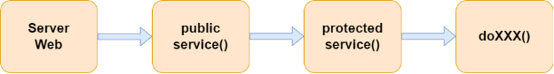

## Serveur Tomcat

Un serveur Tomcat (nom complet Apache Tomcat) est une implémentation de plusieurs spécifications Jakarta EE (anciennement Java EE) qui permet de créer des serveurs HTTP en Java "pur". Tomcat implémente entre autre les spécifications pour les servlet Java et les pages JSP.

Un serveur Tomcat est configuré par plusieurs fichiers XML. Son architecture interne ressemble à ceci


Grâce à cette architecture, on peut déployer plusieurs applications web sur le même serveur. Chacune d'entre elle sera alors contenue dans son propre context. Par exemple si j'ai deux applications web nommées Application1 et Application2, chacune d'entre elle aura son contexte propre.

On pourrait donc accéder à ces applications à l'aide des adresses suivantes:

- http://localhost:8080/Application1
- http://localhost:8080/Application2

## Servlets Java

Un servlet Java est principalement un programme Java qui permet de traiter des requêtes HTTP. Un serveur comme Tomcat est requis pour pouvoir exécuter un servlet Java. On peut voir les servlets comme une petite partie du serveur, voir même comme une API.

Les servlets implémentent différentes méthodes qui répondent aux différentes requêtes HTTP.

| Méthode du servlet | Requête HTTP associée |
|:------------------:|:---------------------:|
| `doGet`            | HTTP GET              |
| `doPost`           | HTTP POST             |
| `doPut`            | HTTP PUT              |
| `doDelete`         | HTTP DELETE           |

La configuration d'un servlet Java inclut toujours les attributs suivants:

- name: Le nom du servlet
- value: Le point de terminaison du servlet

Dans les applications web Java plus anciennes, il fallait configurer manuellement les servlets dans le fichier web.xml. La modernisation des IDE fait que maintenant tout peut se faire de façon automatique. Cependant la configuration en XML générée ressemblera à ceci:

```xml
<servlet>
    <servlet-name>{name}</servlet-name>
    <servlet-class>{name}</servlet-class>
</servlet>
<servlet-mapping>
    <servlet-name>{name}</servlet-name>
    <url-pattern>{value}</url-pattern>
</servlet-mapping>
```

Ainsi, pour atteindre les différentes méthodes du servlet, on enverra des requêtre HTTP à l'adresse

`http://localhost:8080/{contexte}/{value}`

Donc pour le contexte Application1 et le servlet ayant comme valeur /hello on enverra nos requêtes à l'adresse.

`http://localhost:8080/Application1/hello`


### Le traitement des requêtes.

Chaque servlet Java implémente également une méthode nommée `service()`. Cette méthode sert de point d'entrée et de répartiteur pour les différentes méthodes du servlet. C'est la méthode `service()` qui redirigera vers les méthodes telles que `doGet()` ou `doPost()` par exemple. Ainsi une requête suivra la chaîne de méthodes suivante.

