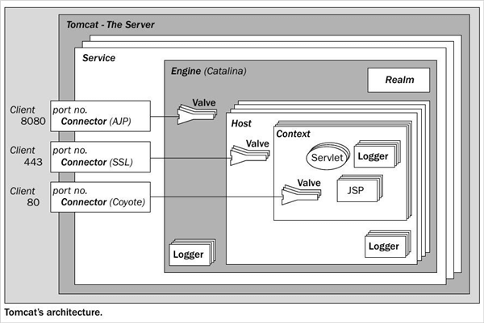

## Serveur Tomcat

Un serveur Tomcat (nom complet Apache Tomcat) est une implémentation de plusieurs spécifications Jakarta EE (anciennement Java EE) qui permet de créer des serveurs HTTP en Java "pur". Tomcat implémente entre autre les spécifications pour les servlet Java et les pages JSP.

Un serveur Tomcat est configuré par plusieurs fichiers XML. Son architecture interne ressemble à ceci

Grâce à cette architecture, on peut déployer plusieurs applications web sur le même serveur. Chacune d'entre elle sera alors contenue dans son propre context. Par exemple si j'ai deux applications web nommées Application1 et Application2, chacune d'entre elle aura son contexte propre.

On pourrait donc accéder à ces applications à l'aide des adresses suivantes:

- http://localhost:8080/Application1
- http://localhost:8080/Application2

## Servlets Java